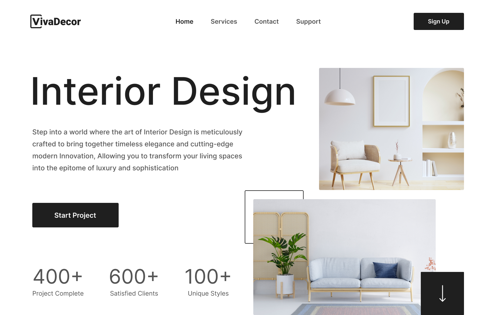

# 🛋️ VivaDecor — Interior Design Landing Page



A modern and minimal landing page for an interior design studio, built with HTML5 and CSS3 to showcase elegance and style.

- 🔗 [Live Demo](https://zhaslansabyr.github.io/kropp-fitness/)
- 🎨 [Figma Design](https://www.figma.com/design/o0YbRKJam3S3IAR7l1mouj/Kropp-Fitness?node-id=0-1&t=M3KtNukdwbmA42co-1)

---

## ✨ Features

- ✅ Semantic and SEO-friendly HTML5 structure
- 🎨 Modern CSS3 styling with Normalize.css reset
- 📱 Fully responsive layout for all screen sizes and devices
- 🧹 Clean CSS architecture with separate folders for base styles and reusable components
- 🗂️ Organized asset management for images, icons, and fonts

---

## 📁 Project Structure

```
├── index.html
│
├── styles/
│   │── base/
│   │── blocks/
│   │── components/
│   └── main.css
│
├── assets/
│   │── images/
│   │── icons/
│   └── fonts/
│
├── README.md
└── .gitignore
```

---

## 📬 Contact

- 📲 Telegram: [@zhaslansabyr](https://t.me/zhaslansabyr)
- 💼 LinkedIn: [zhaslansabyr](https://linkedin.com/in/zhaslansabyr)
- 🐱 GitHub: [zhaslansabyr](https://github.com/zhaslansabyr)
- 📧 Email: [zhaslansabyr@gmail.com](mailto:zhaslansabyr@gmail.com)
